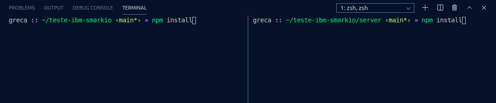
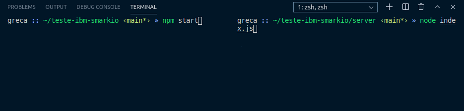

# Teste Prático de Programação - SMARKIO

## Frameworks e Ferramentas utilizados(as)

* ReactJS com a biblioteca Styled Components
* NodeJS
* Express
* Watson IBM API
* Axios como AJAX (do ReactJS)
* MySQL
* Git
* Visual Studio Code

## Como executar

### Pré-requisitos
Antes de executar, é necessário ter o MySQL instalado no seu ambiente local. Se já tiver, ou depois que tiver instalado, crie um banco de dados com o nome **watsonibm** e, dentro dele, crie uma tabela com o nome **comentarios**. Ambos podem ser criados utilizando os seguintes comandos SQL:

```sql
CREATE DATABASE watsonibm;
```

```sql
USE watsonibm;
```

```sql
CREATE TABLE comentarios (id INT AUTO_INCREMENT PRIMARY KEY, conteudo TEXT(300) NOT NULL);
```

Para baixar os arquivos será necessário ter o Git instalado no ambiente local. Se já tiver, ou depois que tiver instalado, utilize o seguinte comando no terminal e na pasta onde deseja instalar:

```git
git clone https://github.com/rafaelgreca/teste-ibm-smarkio.git
```

Caso não tenha o Git instalado, clique no botão verde **Code**, baixe o arquivo ZIP, escolha onde deseja armazenar e depois descompacte/extraia o arquivo.

## Execução

Depois de já ter realizado os passos anteriores, abra dois terminais dentro do endereço da pasta. Um será utilizado para rodar o servidor e o outro o cliente. Para executar o cliente, utilize o comando "npm install" e depois "npm start". Para executar o servidor, devemos entrar na pasta **server**, utilizar o comando "npm install" e depois "node index.js". Todos os comandos estão demonstrados nas figuras abaixo.



Depois use os comandos:



Acesse o link [http://localhost:3000](http://localhost:3000) no seu navegador para utilizar a aplicação.

## Configurações

Caso deseje trocar as configurações do banco de dados, acesse o arquivo **index.js**, que está dentro da pasta **server**, e modifique as seguintes variáveis:

```javascript
const connection = mysql.createConnection({
    host: 'localhost',
    user: 'root',
    password: 'password',
    database: 'watsonibm'
});
```

Recomendação: modifique somente as variáveis **user** e **password**. Confira antes se as informações digitadas estão corretas. **root** e **password** são os valores padrão do MySQL.

Para trocar as configurações da API Watson IBM, primeiramente crie uma conta gratuita acessando esse [link](https://www.ibm.com/cloud/watson-text-to-speech). Depois, também dentro do arquivo **index.js**, modifique as seguintes variáveis com as suas credenciais:

```javascript
const textToSpeech = new TextToSpeechV1({
    authenticator: new IamAuthenticator({ apikey: 'oK7pWnrU4Up7jJVS_qPMd7Yt6baYVtbTTeu57U1WmUac' }),
    serviceUrl: 'https://api.us-south.text-to-speech.watson.cloud.ibm.com/instances/e1e8b38e-27b3-42b8-b42a-70eb0c12daf5'
});
```